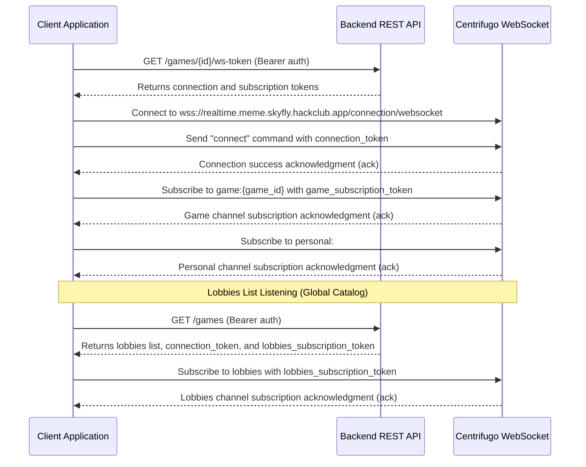

# WebSocket Integration Guide for Frontend Developers

This guide provides integration details for the real-time notification system in the Meme Battle game. The backend uses **Centrifugo** as the WebSocket message broker. Client applications establish a single WebSocket connection with Centrifugo and subscribe to public and private channels using access tokens generated by the backend REST API.

---

## 1. Connection Workflow

To receive real-time events, the client application must follow this lifecycle:



---

## 2. Token Retrieval API

All client WebSocket connections and channel subscriptions require authorization tokens.

### Retrieve Tokens for a Specific Game
* **Endpoint**: `GET /games/{game_id}/ws-token`
* **Headers**: `Authorization: Bearer <access_token>`
* **Response (`200 OK`)**:
  ```json
  {
    "success": true,
    "data": {
      "connection_token": "eyJhbGciOi...",
      "game_subscription_token": "eyJhbGciOi...",
      "personal_subscription_token": "eyJhbGciOi..."
    }
  }
  ```

### Retrieve Tokens for the Lobbies List (Games Catalog)
* **Endpoint**: `GET /games`
* **Headers**: `Authorization: Bearer <access_token>`
* **Response (`200 OK`)**:
  ```json
  {
    "success": true,
    "data": {
      "games": [
        {
          "id": "d3b07384-d113-4956-a517-8828d18471a4",
          "host_id": "8f7b3b4f-8ce6-4a41-86cc-ef5ef33a1e3a",
          "mode": "situation_to_meme",
          "max_rounds": 3,
          "hand_size": 5,
          "players_count": 1,
          "created_at": "2026-07-06T13:46:27.964Z"
        }
      ],
      "connection_token": "eyJhbGciOi...",
      "lobbies_subscription_token": "eyJhbGciOi..."
    }
  }
  ```

---

## 3. Protocol Messages (JSON Frames)

Centrifugo protocol messages are sent and received as JSON strings over the established WebSocket connection. Every sent command must contain a unique integer identifier `id`, which will be returned in the acknowledgment response.

### Establishing Connection
To establish a connection, use the following endpoints:
* `wss://realtime.meme.skyfly.hackclub.app/connection/websocket`

After opening the WebSocket connection, send the `connect` frame:
```json
{
  "connect": {
    "token": "<connection_token>"
  },
  "id": 1
}
```

### Channel Subscription
Subscribe to the necessary channels:

1. **Game Channel** (`game:{game_id}`):
   ```json
   {
     "subscribe": {
       "channel": "game:d3b07384-d113-4956-a517-8828d18471a4",
       "token": "<game_subscription_token>"
     },
     "id": 2
   }
   ```

2. **Player Personal Channel** (`personal:#{user_id}`):
   ```json
   {
     "subscribe": {
       "channel": "personal:#8f7b3b4f-8ce6-4a41-86cc-ef5ef33a1e3a",
       "token": "<personal_subscription_token>"
     },
     "id": 3
   }
   ```

3. **Lobbies Channel** (`lobbies`):
   ```json
   {
     "subscribe": {
       "channel": "lobbies",
       "token": "<lobbies_subscription_token>"
     },
     "id": 4
   }
   ```

---

## 4. Event Envelope Structure

All event notifications sent by the server are wrapped in a Centrifugo `push` container. The actual game data is located at `push.pub.data`.

### Envelope Example:
```json
{
  "push": {
    "channel": "game:d3b07384-d113-4956-a517-8828d18471a4",
    "pub": {
      "data": {
        "event_id": "9bc1a378-cf12-4cf4-9118-8f81e378da12",
        "event_type": "<event_type_in_snake_case>",
        "game_id": "d3b07384-d113-4956-a517-8828d18471a4",
        "user_id": null,
        "occurred_at": "2026-07-06T13:46:27.964Z",
        "version": 12,
        "payload": {
           "..."
        }
      },
      "offset": 5,
      "epoch": "xyz..."
    }
  }
}
```

---

## 5. Event Payloads Directory

### PlayerJoined (`player_joined`)
* **Channel**: `game:{game_id}`
* **Trigger**: A player joined the game lobby.
```json
{
  "user_id": "8f7b3b4f-8ce6-4a41-86cc-ef5ef33a1e3a",
  "players_count": 3
}
```

### PlayerReadyChanged (`player_ready_changed`)
* **Channel**: `game:{game_id}`
* **Trigger**: A player toggled their readiness status.
```json
{
  "user_id": "8f7b3b4f-8ce6-4a41-86cc-ef5ef33a1e3a",
  "is_ready": true
}
```

### GameStarted (`game_started`)
* **Channel**: `game:{game_id}`
* **Trigger**: The host started the game.
```json
{
  "rounds_count": 3,
  "hand_size": 5,
  "current_round_number": 1
}
```

### RoundStarted (`round_started`)
* **Channel**: `game:{game_id}`
* **Trigger**: A new round has started.
```json
{
  "round_id": "2bc8f31b-ab34-4bc1-aa8e-da71f28b34c2",
  "round_number": 1,
  "phase": "submitting",
  "prompt_kind": "situation",
  "prompt_content": "When the team lead asks to rewrite the backend in Rust over the weekend",
  "phase_expires_at": "2026-07-06T13:47:27.964Z"
}
```

> [!NOTE]
> Meme Battle has two round modes depending on the `prompt_kind` value:
> 1. If `prompt_kind` is `"situation"` (Situation as prompt):
>    - The round prompt is a text situation. The `prompt_content` field contains the **prompt text**.
>    - Players receive and must submit **memes** (cards of kind `"meme"` containing an `image_url` link).
> 2. If `prompt_kind` is `"meme"` (Meme as prompt):
>    - The round prompt is a meme template / image. The `prompt_content` field contains the **meme image URL** (`image_url`).
>    - Players receive and must submit **situations** (text cards of kind `"situation"` containing a `text` field).

### HandUpdated (`hand_updated`)
* **Channel**: `personal:#{user_id}` (Private)
* **Trigger**: The player's hand has been updated (at the start of a round). Contains meme or situation cards intended only for the current recipient. The structure of the cards in the array depends on their `kind`:
  - For `kind: "meme"`, an `image_url` link (meme image address) is returned.
  - For `kind: "situation"`, a `text` field (situation text) is returned.
```json
{
  "round_id": "2bc8f31b-ab34-4bc1-aa8e-da71f28b34c2",
  "cards": [
    {
      "id": "e8d9c7a1-8cb4-49c1-aa8f-d128d18451c2",
      "kind": "meme",
      "image_url": "/media/uploads/meme_template_123.jpg"
    },
    {
      "id": "f8a9d7c2-8bb4-48d1-ab9f-d318e19461f3",
      "kind": "situation",
      "text": "When code compiles on the first try"
    }
  ]
}
```

### SubmissionReceived (`submission_received`)
* **Channel**: `game:{game_id}`
* **Trigger**: A player submitted their selected meme/situation card for the round.
```json
{
  "round_id": "2bc8f31b-ab34-4bc1-aa8e-da71f28b34c2",
  "user_id": "8f7b3b4f-8ce6-4a41-86cc-ef5ef33a1e3a"
}
```

### RoundPhaseChanged (`round_phase_changed`)
* **Channel**: `game:{game_id}`
* **Trigger**: The round phase changed (e.g., transition from `submitting` (card submission) to `voting`).
```json
{
  "round_id": "2bc8f31b-ab34-4bc1-aa8e-da71f28b34c2",
  "phase": "voting",
  "phase_expires_at": "2026-07-06T13:48:27.964Z"
}
```

### VoteReceived (`vote_received`)
* **Channel**: `game:{game_id}`
* **Trigger**: A player voted for another participant's card.
```json
{
  "round_id": "2bc8f31b-ab34-4bc1-aa8e-da71f28b34c2",
  "voter_id": "8f7b3b4f-8ce6-4a41-86cc-ef5ef33a1e3a"
}
```

> [!IMPORTANT]
> To keep the voting process anonymous, the card/submission ID that the player voted for is **not shared** in this event and remains hidden until the round finishes.

### RoundFinished (`round_finished`)
* **Channel**: `game:{game_id}`
* **Trigger**: The voting phase finished. The message contains the winner of the round, the global game scoreboard (accumulated points), and the round scoreboard (number of votes received by each player in this round).
```json
{
  "round_id": "2bc8f31b-ab34-4bc1-aa8e-da71f28b34c2",
  "round_number": 1,
  "winner_user_id": "8f7b3b4f-8ce6-4a41-86cc-ef5ef33a1e3a",
  "scoreboard": [
    { "user_id": "8f7b3b4f-8ce6-4a41-86cc-ef5ef33a1e3a", "score": 1 },
    { "user_id": "99bb18f7-8da6-4aa2-bf9e-f00ee5e2c34a", "score": 0 }
  ],
  "round_scoreboard": [
    { "user_id": "8f7b3b4f-8ce6-4a41-86cc-ef5ef33a1e3a", "score": 2 },
    { "user_id": "99bb18f7-8da6-4aa2-bf9e-f00ee5e2c34a", "score": 1 }
  ]
}
```

### GameFinished (`game_finished`)
* **Channel**: `game:{game_id}`
* **Trigger**: The final round of the game has finished. Shows the overall winner and final leaderboards.
```json
{
  "winner_user_id": "8f7b3b4f-8ce6-4a41-86cc-ef5ef33a1e3a",
  "final_scoreboard": [
    { "user_id": "8f7b3b4f-8ce6-4a41-86cc-ef5ef33a1e3a", "score": 4 },
    { "user_id": "99bb18f7-8da6-4aa2-bf9e-f00ee5e2c34a", "score": 1 }
  ]
}
```

### LobbyCreated (`lobby_created`)
* **Channel**: `lobbies` (Public)
* **Trigger**: A new lobby has been created.
```json
{
  "id": "d3b07384-d113-4956-a517-8828d18471a4",
  "host_id": "8f7b3b4f-8ce6-4a41-86cc-ef5ef33a1e3a",
  "mode": "situation_to_meme",
  "max_rounds": 3,
  "hand_size": 5,
  "players_count": 1,
  "created_at": "2026-07-06T13:46:27.964Z"
}
```

### LobbyUpdated (`lobby_updated`)
* **Channel**: `lobbies` (Public)
* **Trigger**: A player joined/left and player count changed.
```json
{
  "id": "d3b07384-d113-4956-a517-8828d18471a4",
  "players_count": 2
}
```

### LobbyRemoved (`lobby_removed`)
* **Channel**: `lobbies` (Public)
* **Trigger**: The lobby was closed or the game session started (and therefore removed from the active lobbies catalog).
```json
{
  "id": "d3b07384-d113-4956-a517-8828d18471a4"
}
```

---

## 6. Message Recovery on Reconnection

Centrifugo supports automatic state recovery after temporary network disconnections, guaranteeing delivery of missed events.

### Recovery Workflow
1. When receiving publications from the server, store:
   - `offset` (from the `push.pub.offset` field)
   - `epoch` (from the `push.pub.epoch` field or the `epoch` field returned in the initial subscription reply)
2. When reconnecting, send a subscription frame with the `"recover": true` flag, passing the stored `offset` and `epoch`:
```json
{
  "subscribe": {
    "channel": "game:d3b07384-d113-4956-a517-8828d18471a4",
    "token": "<game_subscription_token>",
    "recover": true,
    "offset": 12,
    "epoch": "172027..."
  },
  "id": 101
}
```
3. Check the subscription response. If recovery is successful, the server will return `"recovered": true` along with an array of missed events in `"publications"`:
```json
{
  "id": 101,
  "subscribe": {
    "recovered": true,
    "publications": [
      {
        "data": {
          "event_type": "submission_received",
          "..."
        },
        "offset": 13
      }
    ],
    "epoch": "172027..."
  }
}
```
