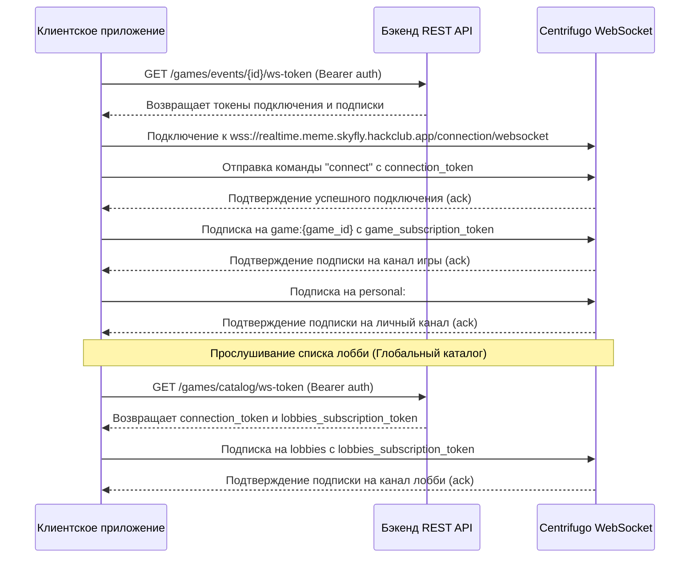

# Руководство по интеграции WebSocket для фронтенд-разработчиков

Это руководство содержит информацию по интеграции с системой уведомлений реального времени в игре Meme Battle. В качестве брокера сообщений WebSocket бэкенд использует **Centrifugo**. Клиентские приложения устанавливают единое WebSocket-соединение с Centrifugo и подписываются на публичные и приватные каналы с помощью токенов доступа, генерируемых REST API бэкенда.

---

## 1. Схема подключения (Connection Workflow)

Для получения событий реального времени клиентское приложение должно пройти следующий жизненный цикл:



---

## 2. API получения токенов (Token Retrieval API)

Все WebSocket-подключения клиентов и подписки на каналы требуют токены авторизации.

### Получение токенов для конкретной игры
* **Эндпоинт**: `GET /games/events/{game_id}/ws-token`
* **Заголовки**: `Authorization: Bearer <access_token>`
* **Ответ (`200 OK`)**:
  ```json
  {
    "success": true,
    "data": {
      "connection_token": "eyJhbGciOi...",
      "game_subscription_token": "eyJhbGciOi...",
      "personal_subscription_token": "eyJhbGciOi..."
    }
  }
  ```

### Получение токенов для списка лобби (каталога игр)
* **Эндпоинт**: `GET /games/catalog/ws-token`
* **Заголовки**: `Authorization: Bearer <access_token>`
* **Ответ (`200 OK`)**:
  ```json
  {
    "success": true,
    "data": {
      "connection_token": "eyJhbGciOi...",
      "lobbies_subscription_token": "eyJhbGciOi..."
    }
  }
  ```

> **Примечание**: `GET /games` теперь возвращает только список активных лобби (без токенов):
> ```json
> {
>   "success": true,
>   "data": {
>     "games": [
>       {
>         "id": "d3b07384-d113-4956-a517-8828d18471a4",
>         "host_id": "8f7b3b4f-8ce6-4a41-86cc-ef5ef33a1e3a",
>         "mode": "situation_to_meme",
>         "max_rounds": 3,
>         "hand_size": 5,
>         "players_count": 1,
>         "created_at": "2026-07-06T13:46:27.964Z"
>       }
>     ]
>   }
> }
> ```

---

## 3. Протокольные сообщения (JSON Фреймы)

Сообщения протокола Centrifugo отправляются и принимаются как JSON-строки по открытому WebSocket-подключению. Каждая отправляемая команда должна содержать уникальный целочисленный идентификатор `id`, который вернется в ответе-подтверждении.

### Установка соединения
Для установки соединения используйте следующие адреса:
* `wss://realtime.meme.skyfly.hackclub.app/connection/websocket`

После открытия WebSocket-соединения отправьте фрейм `connect`:
```json
{
  "connect": {
    "token": "<connection_token>"
  },
  "id": 1
}
```

### Подписка на каналы
Подпишитесь на необходимые каналы:

1. **Канал игры** (`game:{game_id}`):
   ```json
   {
     "subscribe": {
       "channel": "game:d3b07384-d113-4956-a517-8828d18471a4",
       "token": "<game_subscription_token>"
     },
     "id": 2
   }
   ```

2. **Личный канал игрока** (`personal:#{user_id}`):
   ```json
   {
     "subscribe": {
       "channel": "personal:#8f7b3b4f-8ce6-4a41-86cc-ef5ef33a1e3a",
       "token": "<personal_subscription_token>"
     },
     "id": 3
   }
   ```

3. **Канал обновления лобби** (`lobbies`):
   ```json
   {
     "subscribe": {
       "channel": "lobbies",
       "token": "<lobbies_subscription_token>"
     },
     "id": 4
   }
   ```

---

## 4. Структура конверта событий (Event Envelope Structure)

Все уведомления о событиях, отправляемые сервером, оборачиваются в контейнер Centrifugo `push`. Фактические данные игры находятся по пути `push.pub.data`.

### Пример обертки:
```json
{
  "push": {
    "channel": "game:d3b07384-d113-4956-a517-8828d18471a4",
    "pub": {
      "data": {
        "event_id": "9bc1a378-cf12-4cf4-9118-8f81e378da12",
        "event_type": "<event_type_in_snake_case>",
        "game_id": "d3b07384-d113-4956-a517-8828d18471a4",
        "user_id": null,
        "occurred_at": "2026-07-06T13:46:27.964Z",
        "version": 12,
        "payload": {
           "..."
        }
      },
      "offset": 5,
      "epoch": "xyz..."
    }
  }
}
```

---

## 5. Справочник payload-ов событий (Event Payloads)

### PlayerJoined (`player_joined`)
* **Канал**: `game:{game_id}`
* **Триггер**: Игрок вошел в лобби игры.
```json
{
  "user_id": "8f7b3b4f-8ce6-4a41-86cc-ef5ef33a1e3a",
  "players_count": 3
}
```

### PlayerReadyChanged (`player_ready_changed`)
* **Канал**: `game:{game_id}`
* **Триггер**: Игрок переключил свой статус готовности.
```json
{
  "user_id": "8f7b3b4f-8ce6-4a41-86cc-ef5ef33a1e3a",
  "is_ready": true
}
```

### GameStarted (`game_started`)
* **Канал**: `game:{game_id}`
* **Триггер**: Создатель/хост запустил игру.
```json
{
  "rounds_count": 3,
  "hand_size": 5,
  "current_round_number": 1
}
```

### RoundStarted (`round_started`)
* **Канал**: `game:{game_id}`
* **Триггер**: Начался новый раунд игры.
```json
{
  "round_id": "2bc8f31b-ab34-4bc1-aa8e-da71f28b34c2",
  "round_number": 1,
  "phase": "submitting",
  "prompt_kind": "situation",
  "prompt_content": "Когда тимлид сказал переписать бэкенд на Rust за выходные",
  "phase_expires_at": "2026-07-06T13:47:27.964Z"
}
```

> [!NOTE]
> В игре Meme Battle есть два режима раундов в зависимости от значения `prompt_kind`:
> 1. Если `prompt_kind` равен `"situation"` (Ситуация в качестве промта):
>    - В качестве промта раунда выступает текстовая ситуация. Поле `prompt_content` содержит **текст ситуации**.
>    - Игроки получают в руку и должны отправлять **мемы** (карточки типа `"meme"` с ссылкой `image_url`).
> 2. Если `prompt_kind` равен `"meme"` (Мем в качестве промта):
>    - В качестве промта раунда выступает шаблон мема / картинка. Поле `prompt_content` содержит **URL-адрес картинки мема** (`image_url`).
>    - Игроки получают в руку и должны отправлять **ситуации** (текстовые карточки типа `"situation"` с полем `text`).

### HandUpdated (`hand_updated`)
* **Канал**: `personal:#{user_id}` (Приватный)
* **Триггер**: Рука игрока обновилась (в начале раунда). Содержит карты мемов или ситуаций, предназначенные только для текущего получателя. Структура карт в массиве зависит от их типа (`kind`):
  - При `kind: "meme"` возвращается ссылка `image_url` (адрес картинки мема).
  - При `kind: "situation"` возвращается текст `text` (текст ситуации).
```json
{
  "round_id": "2bc8f31b-ab34-4bc1-aa8e-da71f28b34c2",
  "cards": [
    {
      "id": "e8d9c7a1-8cb4-49c1-aa8f-d128d18451c2",
      "kind": "meme",
      "image_url": "/media/uploads/meme_template_123.jpg"
    },
    {
      "id": "f8a9d7c2-8bb4-48d1-ab9f-d318e19461f3",
      "kind": "situation",
      "text": "Когда код скомпилировался с первого раза"
    }
  ]
}
```

### SubmissionReceived (`submission_received`)
* **Канал**: `game:{game_id}`
* **Триггер**: Игрок отправил выбранную карту мема/ситуации на раунд.
```json
{
  "round_id": "2bc8f31b-ab34-4bc1-aa8e-da71f28b34c2",
  "user_id": "8f7b3b4f-8ce6-4a41-86cc-ef5ef33a1e3a"
}
```

### RoundPhaseChanged (`round_phase_changed`)
* **Канал**: `game:{game_id}`
* **Триггер**: Фаза раунда изменилась (например, переход из `submitting` (прием карт) в `voting` (голосование)).
```json
{
  "round_id": "2bc8f31b-ab34-4bc1-aa8e-da71f28b34c2",
  "phase": "voting",
  "phase_expires_at": "2026-07-06T13:48:27.964Z"
}
```

### VoteReceived (`vote_received`)
* **Канал**: `game:{game_id}`
* **Триггер**: Игрок отдал голос за карту другого участника.
```json
{
  "round_id": "2bc8f31b-ab34-4bc1-aa8e-da71f28b34c2",
  "voter_id": "8f7b3b4f-8ce6-4a41-86cc-ef5ef33a1e3a"
}
```

> [!IMPORTANT]
> Из соображений секретности процесса голосования, идентификатор выбранной карты / сабмишена, за который проголосовал игрок, **не передается** в этом событии и остается тайной до момента окончания раунда.

### RoundFinished (`round_finished`)
* **Канал**: `game:{game_id}`
* **Триггер**:  Фаза голосования завершилась. Сообщение содержит победителя раунда, а также глобальный рейтинг (накопленные очки за игру) и локальный рейтинг за текущий раунд (количество голосов, полученных каждым игроком в этом раунде).
```json
{
  "round_id": "2bc8f31b-ab34-4bc1-aa8e-da71f28b34c2",
  "round_number": 1,
  "winner_user_id": "8f7b3b4f-8ce6-4a41-86cc-ef5ef33a1e3a",
  "scoreboard": [
    { "user_id": "8f7b3b4f-8ce6-4a41-86cc-ef5ef33a1e3a", "score": 1 },
    { "user_id": "99bb18f7-8da6-4aa2-bf9e-f00ee5e2c34a", "score": 0 }
  ],
  "round_scoreboard": [
    { "user_id": "8f7b3b4f-8ce6-4a41-86cc-ef5ef33a1e3a", "score": 2 },
    { "user_id": "99bb18f7-8da6-4aa2-bf9e-f00ee5e2c34a", "score": 1 }
  ]
}
```

### GameFinished (`game_finished`)
* **Канал**: `game:{game_id}`
* **Триггер**: Финальный раунд игры завершен. Показывает победителя всей партии и итоговую таблицу лидеров.
```json
{
  "winner_user_id": "8f7b3b4f-8ce6-4a41-86cc-ef5ef33a1e3a",
  "final_scoreboard": [
    { "user_id": "8f7b3b4f-8ce6-4a41-86cc-ef5ef33a1e3a", "score": 4 },
    { "user_id": "99bb18f7-8da6-4aa2-bf9e-f00ee5e2c34a", "score": 1 }
  ]
}
```

### LobbyCreated (`lobby_created`)
* **Канал**: `lobbies` (Публичный)
* **Триггер**: Создано новое лобби.
```json
{
  "id": "d3b07384-d113-4956-a517-8828d18471a4",
  "host_id": "8f7b3b4f-8ce6-4a41-86cc-ef5ef33a1e3a",
  "mode": "situation_to_meme",
  "max_rounds": 3,
  "hand_size": 5,
  "players_count": 1,
  "created_at": "2026-07-06T13:46:27.964Z"
}
```

### LobbyUpdated (`lobby_updated`)
* **Канал**: `lobbies` (Публичный)
* **Триггер**: Количество игроков в лобби изменилось.
```json
{
  "id": "d3b07384-d113-4956-a517-8828d18471a4",
  "players_count": 2
}
```

### LobbyRemoved (`lobby_removed`)
* **Канал**: `lobbies` (Публичный)
* **Триггер**: Лобби закрылось или игра началась (игра удалена из каталога).
```json
{
  "id": "d3b07384-d113-4956-a517-8828d18471a4"
}
```

---

## 6. Восстановление пропущенных сообщений при переподключении (Message Recovery)

При временной потере сети Centrifugo поддерживает автоматическое восстановление состояния, что гарантирует доставку пропущенных событий.

### Процесс восстановления
1. При получении публикаций от сервера сохраняйте:
   - `offset` (из поля `push.pub.offset`)
   - `epoch` (из поля `push.pub.epoch` или поля `epoch` в ответе на первичную подписку)
2. При разрыве соединения и переподключении отправьте фрейм подписки с флагом `"recover": true`, передав сохраненные `offset` и `epoch`:
```json
{
  "subscribe": {
    "channel": "game:d3b07384-d113-4956-a517-8828d18471a4",
    "token": "<game_subscription_token>",
    "recover": true,
    "offset": 12,
    "epoch": "172027..."
  },
  "id": 101
}
```
3. Проверьте ответ на подписку. В случае успешного восстановления сервер вернет `"recovered": true` и массив пропущенных событий `"publications"`:
```json
{
  "id": 101,
  "subscribe": {
    "recovered": true,
    "publications": [
      {
        "data": {
          "event_type": "submission_received",
          "..."
        },
        "offset": 13
      }
    ],
    "epoch": "172027..."
  }
}
```
